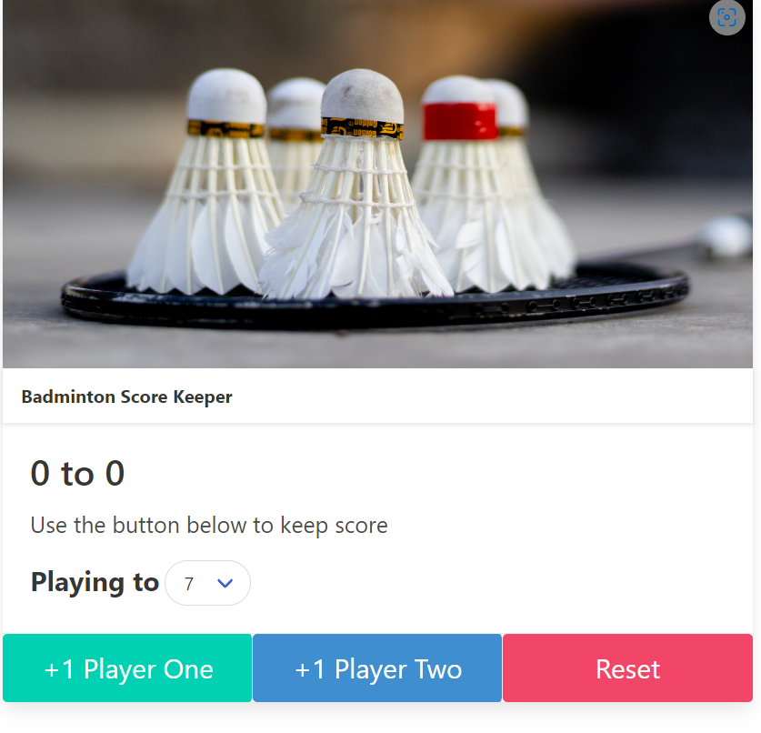
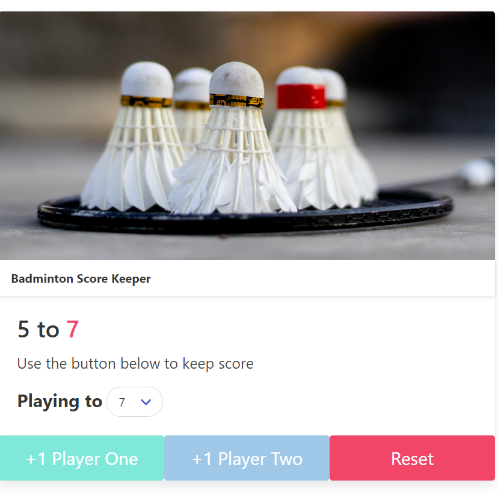

# Badminton_Score_keeper

## This is Badminton Score Keeper App using html,bulma and javascript  
## This app let's the players to play badminton and keep the score check and also one can choose upto which score they can play till one loses.

<h3>I have created dropdown list for it the numbers ranges from 3 to 11. 
One can choose it and till the number is not hit by the any one player the score will keep on counting.  
Once the score is reached by one of the player it will show the winner in green color and loser in red color.  
There is reset button which will help in reseting the scores. 
<b>The technologies used are: Html,javascript and bulma.</b> 
 
 
</h3>
